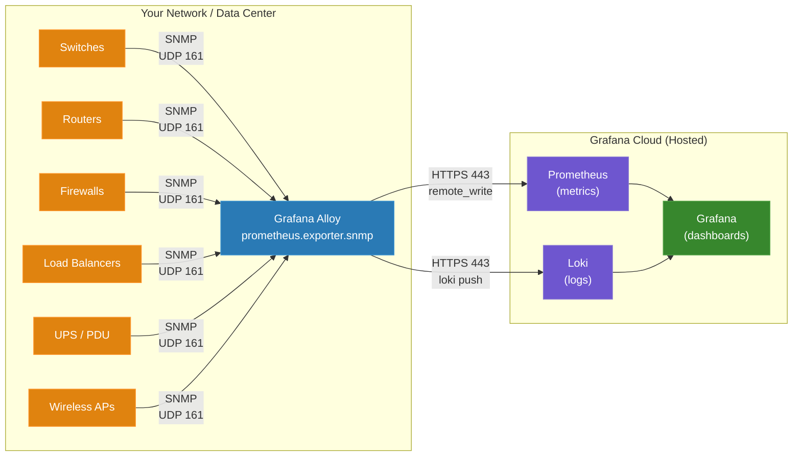

# Network Device Monitoring with Grafana Cloud

A reference guide for network engineers moving from SolarWinds, ThousandEyes, PRTG, or similar NMS platforms to Grafana Cloud with Prometheus.

## How to Read This Guide

If you've managed network infrastructure with SolarWinds NPM, ThousandEyes, or PRTG, you already know what needs monitoring and why. This guide maps the concepts and workflows you know to their Grafana Cloud equivalents. It won't explain what SNMP is or why you should monitor your switches — you already know that.

**What's different:** Traditional NMS tools are monolithic — one vendor, one agent, one UI. Grafana Cloud is composable. You assemble a pipeline from discrete components that each do one thing well. This feels unfamiliar at first but gives you flexibility that monolithic tools can't match.

## The Concept Map

The single biggest hurdle is vocabulary. Here's the Rosetta Stone:

| SolarWinds / ThousandEyes | Grafana Cloud Equivalent | Notes |
|---|---|---|
| **Orion Server** | **Grafana Cloud stack** | Hosted SaaS — no server to maintain |
| **Orion Poller / Remote Poller** | **Grafana Alloy** | Lightweight agent deployed near your devices. Replaces Grafana Agent (EOL Nov 2025) |
| **Node** | **Target** | A device Alloy polls via SNMP |
| **Interface** | **Labels on a metric** | Each port becomes a label combination, not a separate object |
| **UnDP (Universal Device Poller)** | **Custom MIB module in snmp.yml** | Define OIDs to poll for vendor-specific metrics |
| **MIB Studio / MIB Browser** | **snmpwalk + SNMP Exporter generator** | CLI tools that parse MIBs into Alloy-readable config |
| **Alert / Advanced Alert** | **Grafana Alerting (PromQL-based)** | Write alert conditions as PromQL queries |
| **NPM Dashboard / NOC View** | **Grafana dashboard** | Fully customizable; JSON-based, version-controllable |
| **SolarWinds AppStack / Dependencies** | **Grafana canvas panel + service maps** | Topology visualization |
| **ThousandEyes Agent** | **Grafana Synthetic Monitoring** | Probes from global PoPs; HTTP, DNS, ping, traceroute |
| **ThousandEyes Path Visualization** | **Synthetic Monitoring + traceroute checks** | Not 1:1 but covers the core use case |
| **ThousandEyes BGP Route Visualization** | **BGP metrics via SNMP or streaming telemetry** | Collect BGP state from your routers directly |
| **PRTG Sensor** | **Prometheus metric** | Each thing you measure is a metric with labels |
| **PRTG Probe** | **Alloy instance** | Deployed in each site/segment |
| **Per-node licensing** | **Per-active-series pricing** | Pay for what you send, not how many devices you have |

## Architecture: What Replaces Your NMS Server



**Alloy** is the only component you deploy on-prem. It runs on a Linux VM or container near your network devices. It:

- Polls your devices via SNMP (v2c or v3)
- Converts SNMP responses to Prometheus metrics
- Ships metrics to Grafana Cloud over HTTPS (port 443 outbound only)

There is no database to manage, no web server to patch, no SQL backend to tune. If you've spent time maintaining Orion database health or sizing PRTG core servers, that operational burden goes away.

### Alloy vs. What You're Used To

| Concern | SolarWinds Orion | Grafana Alloy |
|---|---|---|
| **Deployment** | Windows Server + SQL Server | Single binary, ~100 MB, Linux or Windows |
| **High availability** | Additional Orion HA server | Run two Alloy instances with same config |
| **Scaling** | Larger Orion server or additional pollers | Add more Alloy instances; each handles 20-30 devices comfortably |
| **Updates** | Orion upgrade cycle (downtime) | Replace binary, restart service. Config format is stable |
| **Config management** | GUI-driven, hard to version-control | Text files (HCL-like syntax). Git-friendly |
| **Resource footprint** | 16+ GB RAM, dedicated SQL Server | ~256 MB RAM for typical SNMP workload |

## Step 1: Install Alloy

Alloy replaces the SolarWinds poller. Deploy it on a Linux VM that has network reachability to your SNMP devices on UDP port 161.

### Linux (systemd)

```bash
# Debian/Ubuntu
sudo apt-get install -y gpg
sudo mkdir -p /etc/apt/keyrings/
wget -q -O - https://apt.grafana.com/gpg.key | gpg --dearmor | sudo tee /etc/apt/keyrings/grafana.gpg > /dev/null
echo "deb [signed-by=/etc/apt/keyrings/grafana.gpg] https://apt.grafana.com stable main" | sudo tee /etc/apt/sources.list.d/grafana.list
sudo apt-get update
sudo apt-get install -y alloy

# RHEL/CentOS/Rocky
sudo rpm --import https://rpm.grafana.com/gpg.key
cat <<EOF | sudo tee /etc/yum.repos.d/grafana.repo
[grafana]
name=grafana
baseurl=https://rpm.grafana.com
repo_gpgcheck=1
enabled=1
gpgcheck=1
gpgkey=https://rpm.grafana.com/gpg.key
EOF
sudo yum install -y alloy
```

### Docker

```bash
docker run -d \
  --name alloy \
  -v /etc/alloy:/etc/alloy \
  -e GRAFANA_METRICS_URL="https://prometheus-prod-XX-prod-us-east-0.grafana.net/api/prom/push" \
  -e GRAFANA_METRICS_USERNAME="YOUR_STACK_ID" \
  -e GCLOUD_RW_API_KEY="YOUR_API_KEY" \
  -e SNMP_COMMUNITY="your-community-string" \
  grafana/alloy:latest \
  run /etc/alloy/config.alloy
```

### Set Environment Variables

Alloy reads credentials from environment variables — never hardcode them in config files.

For systemd deployments, create `/etc/alloy/env`:

```bash
GRAFANA_METRICS_URL=https://prometheus-prod-XX-prod-us-east-0.grafana.net/api/prom/push
GRAFANA_METRICS_USERNAME=YOUR_STACK_ID
GCLOUD_RW_API_KEY=YOUR_API_KEY
SNMP_COMMUNITY=your-community-string
```

Find your Grafana Cloud credentials at: **grafana.com -> My Account -> your stack -> Prometheus details -> Remote Write Endpoint**.

## Step 2: Get the SNMP Module File

SolarWinds discovers OIDs automatically via MIB Studio. In the Prometheus world, available OIDs are defined in a **module file** (`snmp.yml`) that maps SNMP OIDs to Prometheus metric names.

### Option A: Use the Default (Covers Most Cases)

Download the latest `snmp.yml` from the [snmp_exporter releases page](https://github.com/prometheus/snmp_exporter/releases) and place it in `/etc/alloy/snmp.yml`.

The default file includes modules for:

| Module | Covers |
|---|---|
| `if_mib` | Standard interface metrics (RFC 2863) — works on virtually every network device |
| `apcups` | APC UPS systems |
| `synology` | Synology NAS appliances |
| `cisco_device` | Cisco-specific CPU, memory, environment sensors |
| `juniper` | Juniper device metrics |
| `mikrotik` | MikroTik RouterOS metrics |

For most network monitoring, **`if_mib` is all you need to start**. It gives you interface traffic, errors, status, and speed — the same core data you see in SolarWinds NPM's interface details view.

### Option B: Generate Custom Modules (Vendor-Specific MIBs)

This is the equivalent of SolarWinds UnDP (Universal Device Poller). When you need vendor-specific OIDs beyond what `if_mib` provides:

```bash
# Install the generator
go install github.com/prometheus/snmp_exporter/generator@latest

# Create generator.yml
cat > generator.yml << 'EOF'
modules:
  my_cisco_switch:
    walk:
      - ifMIB                           # Standard interfaces
      - 1.3.6.1.4.1.9.9.109            # Cisco CPU (cpmCPU)
      - 1.3.6.1.4.1.9.9.48             # Cisco memory pool
    lookups:
      - source_indexes: [ifIndex]
        lookup: ifAlias
      - source_indexes: [ifIndex]
        lookup: ifDescr
    overrides:
      ifAlias:
        type: DisplayString
      ifDescr:
        type: DisplayString
EOF

# Copy vendor MIB files into the mibs/ directory, then generate
generator generate
# Produces snmp.yml — deploy to /etc/alloy/snmp.yml
```

**Important:** The MIB files must match the firmware version on your devices. A MIB from IOS-XE 17.x won't correctly map OIDs on a device running 16.x. This is the equivalent of SolarWinds "MIB database update" — but you control the source.

## Step 3: Configure Alloy

This is the production-ready Alloy configuration. Place it at `/etc/alloy/config.alloy`.

The SolarWinds equivalent of this entire file is: adding nodes in the Orion web console, assigning pollers, configuring what to monitor, and setting up the database connection. Here, it's all in one text file.

```alloy
// ================================================================
// Network Device Monitoring via SNMP
// ================================================================

// --- Where to send metrics (your Grafana Cloud stack) ---
prometheus.remote_write "grafana_cloud" {
  endpoint {
    url = sys.env("GRAFANA_METRICS_URL")
    basic_auth {
      username = sys.env("GRAFANA_METRICS_USERNAME")
      password = sys.env("GCLOUD_RW_API_KEY")
    }
  }
}

// --- Load the SNMP module file ---
local.file "snmp_modules" {
  filename = "/etc/alloy/snmp.yml"
}

// --- Define your devices ---
prometheus.exporter.snmp "network_devices" {
  config = local.file.snmp_modules.content

  // Core switches
  target "core-sw-01" {
    address     = "10.0.1.1"
    module      = "if_mib"
    auth        = "v2c_readonly"
    walk_params = "standard"
  }

  target "core-sw-02" {
    address     = "10.0.1.2"
    module      = "if_mib"
    auth        = "v2c_readonly"
    walk_params = "standard"
  }

  // Access switches
  target "access-sw-01" {
    address     = "10.0.2.1"
    module      = "if_mib"
    auth        = "v2c_readonly"
    walk_params = "standard"
  }

  target "access-sw-02" {
    address     = "10.0.2.2"
    module      = "if_mib"
    auth        = "v2c_readonly"
    walk_params = "standard"
  }

  // Firewall
  target "fw-01" {
    address     = "10.0.0.1"
    module      = "if_mib"
    auth        = "v3_secure"
    walk_params = "standard"
  }

  // --- SNMP transport settings ---
  walk_params "standard" {
    retries        = 3
    timeout        = "10s"
    max_repetitions = 25
  }

  // --- SNMP v2c auth ---
  auth "v2c_readonly" {
    community = sys.env("SNMP_COMMUNITY")
  }

  // --- SNMP v3 auth (for devices that require it) ---
  auth "v3_secure" {
    security_level = "authPriv"
    username       = sys.env("SNMP_V3_USERNAME")
    auth_protocol  = "SHA"
    auth_password  = sys.env("SNMP_V3_AUTH_PASSWORD")
    priv_protocol  = "AES"
    priv_password  = sys.env("SNMP_V3_PRIV_PASSWORD")
  }
}

// --- Add standard labels ---
discovery.relabel "network_devices" {
  targets = prometheus.exporter.snmp.network_devices.targets

  rule {
    target_label = "job"
    replacement  = "integrations/snmp"
  }

  rule {
    target_label = "instance"
    replacement  = constants.hostname
  }
}

// --- Poll devices ---
prometheus.scrape "network_devices" {
  targets         = discovery.relabel.network_devices.output
  forward_to      = [prometheus.relabel.network_devices.receiver]
  scrape_interval = "60s"
  scrape_timeout  = "30s"
}

// --- Control which metrics are sent (cardinality control) ---
prometheus.relabel "network_devices" {
  forward_to = [prometheus.remote_write.grafana_cloud.receiver]

  // Keep only the metrics we need
  rule {
    source_labels = ["__name__"]
    regex = join([
      "up",
      "snmp_scrape_duration_seconds",
      "snmp_scrape_pdus_returned",
      "snmp_scrape_walk_duration_seconds",

      // Interface status
      "ifAdminStatus",
      "ifOperStatus",
      "ifHighSpeed",
      "ifName",
      "ifAlias",
      "ifDescr",

      // Interface traffic (64-bit counters — always use these, not 32-bit)
      "ifHCInOctets",
      "ifHCOutOctets",
      "ifHCInUcastPkts",
      "ifHCOutUcastPkts",

      // Interface errors
      "ifInErrors",
      "ifOutErrors",
      "ifInDiscards",
      "ifOutDiscards",

      // System info
      "sysUpTime",
      "sysName",
      "sysDescr",
    ], "|")
    action = "keep"
  }

  // Drop admin-down interfaces (unused ports)
  rule {
    source_labels = ["ifAdminStatus"]
    regex         = "2"
    action        = "drop"
  }
}
```

### Config Walkthrough for SolarWinds Users

| Config Block | SolarWinds Equivalent | What It Does |
|---|---|---|
| `prometheus.remote_write` | Database connection | Where metrics are stored (Grafana Cloud) |
| `local.file "snmp_modules"` | MIB database | Loads the OID-to-metric mapping |
| `target "core-sw-01"` | Add Node wizard | Defines a device to monitor |
| `auth "v2c_readonly"` | SNMP credentials in Node properties | Community string or v3 credentials |
| `walk_params "standard"` | Polling engine settings | Timeout, retries, bulk size |
| `prometheus.scrape` | Polling interval setting | How often to poll (60s here) |
| `prometheus.relabel` | No direct equivalent (SolarWinds collects everything) | Filters which metrics to keep — this is how you control cost |

### Key Differences from SolarWinds

**Polling interval:** SolarWinds defaults to 5 or 10 minutes for statistics and 120 seconds for status. In Grafana Cloud, 60 seconds is standard — you get higher resolution data by default.

**No auto-discovery:** SolarWinds scans your network and finds devices. Alloy requires explicit target definitions. For large-scale dynamic environments, you can use file-based service discovery (a YAML file listing targets that Alloy watches for changes) or integrate with your CMDB/IPAM system to generate the target list.

**Metric filtering is your friend:** SolarWinds collects everything and stores it in SQL. With Grafana Cloud, you pay per active series. The `prometheus.relabel` block above keeps only what matters and drops unused ports — this is the most important cost control lever.

## Step 4: Verify It's Working

Before you build dashboards, confirm data is flowing.

### Test SNMP Connectivity

This is the equivalent of SolarWinds "Test" button on the Node properties page:

```bash
# SNMP v2c — does the device respond?
snmpwalk -v2c -c $SNMP_COMMUNITY 10.0.1.1 sysDescr

# Expected output:
# SNMPv2-MIB::sysDescr.0 = STRING: Cisco IOS Software, C9300 Software...

# SNMP v3
snmpwalk -v3 -l authPriv -u monitoring -a SHA -A "$AUTH_PASS" \
  -x AES -X "$PRIV_PASS" 10.0.1.1 sysDescr
```

**If this times out**, fix it before touching Alloy config:
- Firewall: UDP 161 from the Alloy host to the device
- SNMP enabled on the device (`show snmp` on Cisco)
- Correct community string / v3 credentials
- SNMP access list on the device permits the Alloy host's IP

### Check Alloy Health

```bash
# Alloy exposes its own metrics — check if SNMP scrapes are working
curl -s http://localhost:12345/api/v0/component/prometheus.exporter.snmp.network_devices/metrics | head -20
```

### Query in Grafana Cloud

Once metrics appear, go to your Grafana Cloud instance -> Explore -> select your Prometheus data source, and run:

```promql
up{job="integrations/snmp"}
```

Each target with a value of `1` is being polled successfully. A value of `0` means the SNMP walk is failing for that target.

## Step 5: Build Dashboards

### The Grafana Cloud SNMP Integration (Fastest Path)

Grafana Cloud includes a built-in SNMP integration that gives you:
- **3 pre-built dashboards** (fleet overview, device detail, logs)
- **14 alert rules** (interface down, high CPU, memory, reboot detection, exporter health)
- **61 pre-mapped metrics** across vendor-neutral and vendor-specific modules

Install it from: **Grafana Cloud -> Connections -> Add new connection -> SNMP**.

This is the closest thing to SolarWinds' "out-of-box" experience. Start here, then customize.

### Essential PromQL for Network Engineers

PromQL is the query language for Prometheus metrics. If you've written SolarWinds SWQL queries or custom pollers, PromQL will feel more powerful but different. Here are the queries you'll use most:

#### Interface Utilization (% of Link Speed)

SolarWinds shows this as the colored bar on interface detail pages.

PromQL:

```promql
rate(ifHCInOctets{job="integrations/snmp"}[5m]) * 8
/ (ifHighSpeed * 1e6)
* 100
```

Breakdown:
- `rate(...[5m])` — calculates bytes/second over 5 minutes (like SolarWinds "average bps")
- `* 8` — converts bytes to bits
- `/ (ifHighSpeed * 1e6)` — divides by interface speed (ifHighSpeed is in Mbps, so multiply by 1M)
- `* 100` — percentage

#### Top 10 Busiest Ports

SolarWinds: "Top 10 Interfaces by Percent Utilization" resource.

PromQL:

```promql
topk(10,
  rate(ifHCInOctets{job="integrations/snmp"}[5m]) * 8
)
```

#### Ports with Errors (Last Hour)

SolarWinds: "Interface Errors & Discards" resource.

PromQL:

```promql
increase(ifInErrors{job="integrations/snmp"}[1h]) > 0
```

`increase()` over an hour is equivalent to SolarWinds' "delta" — how many new errors occurred in that window.

#### Link Down (Admin Up, Oper Down)

SolarWinds: Node detail page shows "Interface Status" with red/green indicators.

PromQL:

```promql
ifAdminStatus{job="integrations/snmp"} == 1
  and
ifOperStatus{job="integrations/snmp"} == 2
```

This is the classic "cable unplugged" or "far-end device down" detection.

#### Device Uptime (Has It Rebooted?)

SolarWinds: "Last Boot" field on Node Summary.

PromQL:

```promql
sysUpTime{job="integrations/snmp"} / 100 / 86400
```

sysUpTime is in hundredths of a second; dividing by 100 gives seconds, then by 86400 gives days. Alert on `< 0.003` (about 5 minutes) to catch unexpected reboots.

### Dashboard Layout Recommendations

Build your dashboards to answer the same questions your NOC asks today:

| NOC Question | SolarWinds View | Grafana Panel Type |
|---|---|---|
| "What's down right now?" | Active Alerts / All Nodes view | Stat panel with `ifOperStatus == 2` count |
| "What's close to capacity?" | Top 10 Interfaces resource | Table panel with utilization % sorted descending |
| "Is this interface erroring?" | Interface details / Errors tab | Time series panel showing `rate(ifInErrors[5m])` |
| "When did it go down?" | Events / Syslog | Time series with annotations from Loki log queries |
| "What's the traffic trend?" | Interface traffic graph | Time series panel with `rate(ifHCInOctets[5m]) * 8` |
| "Network topology" | Network Atlas / Orion Maps | Canvas panel with device layout |

## Alerting: Replacing SolarWinds Alerts

SolarWinds alerts are configured through a GUI with trigger conditions. Grafana alerting uses PromQL expressions evaluated on a schedule. The result is more flexible (any PromQL query can be an alert) but requires writing the query.

### Essential Alert Rules

These cover the same ground as SolarWinds' default "out of box" alerts:

| Alert | PromQL | Equivalent SolarWinds Alert |
|---|---|---|
| **Interface down** | `ifAdminStatus == 1 and ifOperStatus == 2` | "Interface went down" |
| **High bandwidth** | `rate(ifHCInOctets[5m]) * 8 / (ifHighSpeed * 1e6) > 0.80` | "Interface utilization > 80%" |
| **Interface errors** | `rate(ifInErrors[5m]) / (rate(ifHCInUcastPkts[5m]) + rate(ifHCInBroadcastPkts[5m]) + rate(ifHCInMulticastPkts[5m])) > 0.05` | "Percent packet errors > 5%" |
| **Device unreachable** | `up{job="integrations/snmp"} == 0` | "Node is down" |
| **Device rebooted** | `sysUpTime / 100 < 300` | "Node was rebooted" |

### Built-In Alert Rules from the SNMP Integration

The Grafana Cloud SNMP integration includes 14 pre-built alert rules across three groups:

| Group | Rules | Coverage |
|---|---|---|
| `integration-snmp-fc-alerts` | 3 rules | Flow collector alerts |
| `integration-snmp-alerts` | 8 rules | SNMPInterfaceDown, SNMPNodeCPUHighUsage, SNMPNodeMemoryUtilization, SNMPNodeHasRebooted, and more |
| `integration-snmp-exporter-alerts` | 3 rules | SNMPExporterEmptyResponse, SNMPExporterSlowScrape, SNMPExporterNoResponse |

The exporter health alerts have no SolarWinds equivalent — they tell you when your monitoring itself is broken, not just the network.

### Alert Routing

SolarWinds sends alerts to email or triggers actions. Grafana Cloud alerting supports:
- Email, Slack, Microsoft Teams, PagerDuty, OpsGenie, webhooks
- Contact points (who gets notified)
- Notification policies (routing rules — e.g., "critical alerts go to PagerDuty, warnings go to Slack")
- Silences and mute timings (maintenance windows)

This is more capable than SolarWinds alert routing. The notification policy tree lets you route alerts by label (device type, site, severity) without duplicating alert definitions.

## Replacing ThousandEyes Functionality

ThousandEyes provides two things that SNMP monitoring doesn't: **synthetic testing** (is this URL/service reachable and fast from outside?) and **path analysis** (what's the network path and where is the latency?).

### Synthetic Monitoring (Replaces ThousandEyes Tests)

Grafana Cloud Synthetic Monitoring runs checks from globally distributed probes — similar to ThousandEyes Cloud Agents.

| ThousandEyes Test Type | Grafana Synthetic Monitoring Equivalent |
|---|---|
| HTTP Server test | HTTP check (URL, status code, response time, SSL expiry) |
| DNS Server test | DNS check (resolution time, correct records) |
| Network - Agent to Server | Ping/ICMP check (latency, packet loss) |
| Network - Path Visualization | Traceroute check (hop-by-hop latency) |
| BGP Route test | No direct equivalent — use SNMP BGP metrics from your routers |
| Web Transaction (Selenium) | Scripted browser check (k6-based) |

Configure checks at: **Grafana Cloud -> Synthetic Monitoring -> Add Check**.

### What You Won't Get (and Workarounds)

| ThousandEyes Feature | Status in Grafana Cloud | Workaround |
|---|---|---|
| Path Visualization (hop-by-hop diagrams) | Traceroute data exists but no auto-visualization | Use traceroute check data in time series panels; build topology in canvas panels |
| BGP Route Visualization (AS path view) | Not available as SaaS | Collect BGP metrics via SNMP from your own routers; visualize in Grafana |
| Internet Outage Detection | Not available | Synthetic monitoring from multiple probes gives you partial coverage |
| WAN Insights | Not available | Combine SNMP interface metrics with synthetic check latency |

The honest gap: ThousandEyes' network path analysis between arbitrary internet endpoints has no direct equivalent in Grafana Cloud. If you depend on "show me the path from our office to api.stripe.com and where the latency is," that specific capability isn't replicated. However, for monitoring your own infrastructure and services, synthetic monitoring plus SNMP covers the vast majority of use cases.

## Cost Model: Per-Node vs. Per-Series

This is one of the biggest mindset shifts.

**SolarWinds** charges per managed node (SL100 = 100 nodes, SL2000 = 2000 nodes). A 48-port switch and a 4-port router cost the same — one node each.

**Grafana Cloud** charges per active series. A series is a unique combination of metric name + labels. One 48-port switch with 15 metrics per active port might generate 720 series (48 ports x 15 metrics) or 300 series (20 active ports x 15 metrics) depending on your filtering.

### Real-World Cost Comparison

| Scenario | SolarWinds NPM | Grafana Cloud |
|---|---|---|
| 10 switches (48-port) | 10 nodes. SL100 license, ~$2,995/yr + maintenance | ~7,200 series (all ports) = ~$58/mo ($696/yr). With port filtering: ~3,000 series = ~$24/mo |
| 100 switches (campus) | 100 nodes. SL100 license minimum | ~72,000 series = ~$576/mo. With filtering: ~16,000 series = ~$128/mo |
| 500 mixed devices | SL500 license, ~$12,475/yr + maintenance | Varies widely by metric count. Budget $500-2,000/mo depending on filtering |

### The Cardinality Formula

```
active_series = devices x active_ports_per_device x metrics_per_port
```

**Three levers to control cost:**

1. **Filter unused ports** — Drop interfaces where `ifAdminStatus = 2` (the relabel rule in the config above does this). On a typical 48-port access switch, 20-30 ports are usually unused.

2. **Limit metrics per port** — The allow-list in `prometheus.relabel` controls which OIDs are kept. Start with traffic + errors + status (~8 metrics). Add more only if you need them for dashboards.

3. **Scrape interval** — 60s is standard. Network metrics don't change meaningfully in 15 seconds. Longer intervals don't reduce series count, but they do reduce data ingestion volume.

### Grafana Cloud Free Tier

Grafana Cloud includes a free tier with 10,000 active series. That's enough for:
- ~25 switches with 48 ports each, 8 metrics per port, active-port filtering (~20 active ports per switch)
- Or: ~130 devices with 10 active interfaces and 8 metrics each

This lets you evaluate the platform with real production data before committing.

## Scaling: Multi-Site and Large Networks

### SolarWinds Scaling Model

SolarWinds scales by adding Additional Polling Engines (APEs) in remote sites and Additional Web Servers for more users. The Orion database is the bottleneck.

### Grafana Cloud Scaling Model

Grafana Cloud is SaaS — the backend scales automatically. You only scale the collectors:

| Scale | Deployment |
|---|---|
| **1-30 devices in one site** | One Alloy instance |
| **50+ devices in one site** | Two or more Alloy instances, targets split between them |
| **Multiple sites** | One Alloy instance per site. All ship to the same Grafana Cloud stack |
| **Thousands of devices** | Alloy per site + file-based service discovery from CMDB/IPAM. Consider multiple Grafana Cloud SNMP integration instances |

### File-Based Service Discovery (Dynamic Target Lists)

For large or dynamic environments, maintaining target blocks in the Alloy config file becomes unwieldy. Instead, generate a YAML targets file from your CMDB, IPAM, or NetBox:

```yaml
# /etc/alloy/snmp-targets.yml — generated by your CMDB export script
- labels:
    name: core-sw-01
    module: if_mib,system
    auth: v2c_readonly
    site: dc-east
    rack: A01
  targets:
    - 10.0.1.1
- labels:
    name: core-sw-02
    module: if_mib,system
    auth: v2c_readonly
    site: dc-west
    rack: B01
  targets:
    - 10.0.1.2
```

Alloy watches this file and automatically picks up changes — no restart needed. This is the equivalent of SolarWinds' "auto-discovery" but driven by your source of truth.

## Performance Tuning

### SNMP Walk Timing

Every scrape interval, Alloy walks each device's OID tree. Walks are sequential per exporter instance. Plan accordingly:

| Device Count | Ports/Device | Estimated Walk Time | Recommended Setup |
|---|---|---|---|
| 5 | 24 | 5-10s | Single instance, 60s scrape |
| 10 | 48 | 15-30s | Single instance, 60s scrape, 45s timeout |
| 20 | 48 | 30-60s | Single instance, 120s scrape |
| 50+ | Mixed | 60s+ | Split across 2-3 instances |

### Walk Parameter Tuning

| Parameter | Default | When to Change |
|---|---|---|
| `timeout` | 10s | Increase for slow devices (older switches, devices under high CPU) |
| `retries` | 3 | Lower to 1-2 if you prefer fast failure over retries |
| `max_repetitions` | 25 | Increase to 50+ for devices with many interfaces (chassis switches) |

### Why 64-bit Counters Matter

Always use `ifHCInOctets` / `ifHCOutOctets` (64-bit, "High Capacity") instead of `ifInOctets` / `ifOutOctets` (32-bit).

On a 10 Gbps link at full utilization, a 32-bit counter wraps (overflows back to zero) every **3.4 seconds**. The `rate()` function in PromQL sees the counter reset and produces garbage data. SolarWinds handles this transparently; in the Prometheus world, you choose the right counter.

**Rule of thumb:** If you have any interface faster than 100 Mbps (and you do), use 64-bit counters exclusively.

## SNMP v2c vs v3: When to Use Which

| Situation | Use |
|---|---|
| Lab / isolated management VLAN | v2c is fine |
| Production with compliance requirements (PCI, HIPAA, SOC2) | v3 with authPriv |
| Devices that only support v2c | v2c with restricted ACLs on the device |
| Mixed environment | Both — define separate auth blocks |

### v3 Configuration in Alloy

```alloy
auth "v3_secure" {
  security_level = "authPriv"      // noAuthNoPriv | authNoPriv | authPriv
  username       = sys.env("SNMP_V3_USERNAME")
  auth_protocol  = "SHA"           // MD5 or SHA
  auth_password  = sys.env("SNMP_V3_AUTH_PASSWORD")
  priv_protocol  = "AES"           // DES or AES
  priv_password  = sys.env("SNMP_V3_PRIV_PASSWORD")
}
```

| Security Level | Authentication | Encryption | When to Use |
|---|---|---|---|
| `noAuthNoPriv` | No | No | Never in production |
| `authNoPriv` | SHA or MD5 | No | When you need auth but can't do encryption |
| `authPriv` | SHA or MD5 | AES or DES | Default for production |

## What About SNMP Traps?

SolarWinds and PRTG can receive SNMP traps (push-based notifications from devices). The Prometheus SNMP Exporter is **poll-only** — it does not receive traps.

**Workarounds:**

| Approach | How |
|---|---|
| Syslog to Loki | Forward device syslogs to Grafana Alloy (which ships them to Loki). Most events that generate traps also generate syslog messages |
| snmptrapd + script | Run snmptrapd, write traps to a log file, collect with Alloy's `loki.source.file` |
| Webhook receiver | Some modern devices support webhooks — point them at a custom receiver that writes Prometheus metrics |

For most environments, **syslog to Loki is the right answer**. It's more flexible than traps, easier to search, and gives you log-based alerting alongside metric-based alerting.

## What About Streaming Telemetry?

Modern network devices (Cisco IOS-XE/XR, Juniper Junos, Arista EOS) support **model-driven telemetry** (gNMI/gRPC) that pushes metrics to a collector instead of waiting to be polled.

Streaming telemetry is the future of network monitoring, but it's not required to get started. If your devices support it:

| Protocol | Alloy Support | Notes |
|---|---|---|
| gNMI (gRPC Network Management Interface) | Via OpenTelemetry receiver | Requires `otelcol.receiver.otlp` in Alloy config |
| NETCONF/YANG | Not directly supported | Use a third-party collector that exports to Prometheus format |
| Cisco MDT (Model-Driven Telemetry) | Via Telegraf or custom pipeline | Telegraf can receive and convert to Prometheus format |

For most organizations: **start with SNMP, add streaming telemetry for high-value devices** (core routers, spine switches) where sub-second visibility matters.

## Migration Checklist

Use this to plan your migration from SolarWinds/ThousandEyes/PRTG:

### Phase 1: Parallel Run (Weeks 1-2)
- [ ] Deploy Alloy on a Linux VM with network access to SNMP devices
- [ ] Configure 5-10 devices (mix of switches, routers, firewalls)
- [ ] Install the Grafana Cloud SNMP integration (dashboards + alerts)
- [ ] Verify metrics in Grafana Cloud Explore
- [ ] Keep existing NMS running — compare data side by side

### Phase 2: Dashboard Parity (Weeks 3-4)
- [ ] Build (or customize) dashboards matching your current NOC views
- [ ] Configure alert rules matching your current SolarWinds alerts
- [ ] Set up notification routing (Slack, PagerDuty, email)
- [ ] Add synthetic monitoring checks for critical services
- [ ] Train NOC team on Grafana UI and PromQL basics

### Phase 3: Full Migration (Weeks 5-8)
- [ ] Add remaining devices to Alloy config
- [ ] Set up file-based service discovery if >50 devices
- [ ] Configure syslog forwarding to Loki (replaces trap receiver)
- [ ] Deploy Alloy instances in remote sites
- [ ] Review cardinality and optimize cost
- [ ] Document runbooks in Grafana Cloud

### Phase 4: Decommission Legacy (Week 8+)
- [ ] Confirm all SolarWinds alerts have Grafana equivalents
- [ ] Verify historical data needs are met (Grafana Cloud retains 13 months by default)
- [ ] Decommission SolarWinds pollers
- [ ] Decommission Orion server

## Common Gotchas

| Gotcha | Impact | Fix |
|---|---|---|
| Using 32-bit counters on fast links | Garbage rate calculations from counter wraps | Use `ifHC*` (64-bit) counters exclusively |
| Monitoring all 48 ports on access switches | 2-3x the series count (and cost) for zero-value data | Drop `ifAdminStatus=2` ports in relabel rules |
| MIB version mismatch with device firmware | Walk timeouts, missing metrics | Regenerate snmp.yml with MIBs from the correct firmware version |
| Scrape timeout shorter than walk duration | Scrape fails, zero metrics collected | Set `scrape_timeout` to at least 2x expected walk time |
| 50+ devices on one Alloy exporter instance | Walks are sequential — can't finish in one scrape interval | Split across multiple exporter instances (20-30 devices each) |
| Not testing SNMP connectivity first | Hours debugging Alloy config when the device isn't responding to SNMP | Always `snmpwalk` first |
| Hardcoding community strings | Secrets in config files, version control, backups | Use `sys.env("SNMP_COMMUNITY")` — always |
| Forgetting UDP 161 firewall rules | SNMP walks time out silently | Open UDP 161 from Alloy host to target devices |

## Quick Reference: SolarWinds to PromQL

| SolarWinds Metric / View | PromQL Equivalent |
|---|---|
| Interface Receive bps | `rate(ifHCInOctets{ifName="GigabitEthernet0/1"}[5m]) * 8` |
| Interface Transmit bps | `rate(ifHCOutOctets{ifName="GigabitEthernet0/1"}[5m]) * 8` |
| Interface % Utilization | `rate(ifHCInOctets[5m]) * 8 / (ifHighSpeed * 1e6) * 100` |
| Interface Errors/sec | `rate(ifInErrors[5m])` |
| Interface Discards/sec | `rate(ifInDiscards[5m])` |
| Node Uptime (days) | `sysUpTime / 100 / 86400` |
| Top N Interfaces by Traffic | `topk(10, rate(ifHCInOctets[5m]) * 8)` |
| Interface Status (up/down) | `ifOperStatus` (1=up, 2=down) |
| Active Alerts Count | `count(ALERTS{alertstate="firing", job="integrations/snmp"})` |

## Further Reading

- [Grafana Alloy documentation](https://grafana.com/docs/alloy/latest/)
- [Grafana Cloud SNMP integration](https://grafana.com/docs/grafana-cloud/monitor-infrastructure/integrations/integration-reference/integration-snmp/)
- [Prometheus SNMP Exporter (GitHub)](https://github.com/prometheus/snmp_exporter)
- [SNMP Exporter generator documentation](https://github.com/prometheus/snmp_exporter/tree/main/generator)
- [A beginner's guide to network monitoring with Grafana and Prometheus](https://grafana.com/blog/2022/01/19/a-beginners-guide-to-network-monitoring-with-grafana-and-prometheus/)
- [An advanced guide to network monitoring with Grafana and Prometheus](https://grafana.com/blog/2022/02/01/an-advanced-guide-to-network-monitoring-with-grafana-and-prometheus/)
- [Awesome Prometheus Alerts — SNMP rules](https://samber.github.io/awesome-prometheus-alerts/)
- [Grafana Cloud Synthetic Monitoring](https://grafana.com/docs/grafana-cloud/testing/synthetic-monitoring/)
