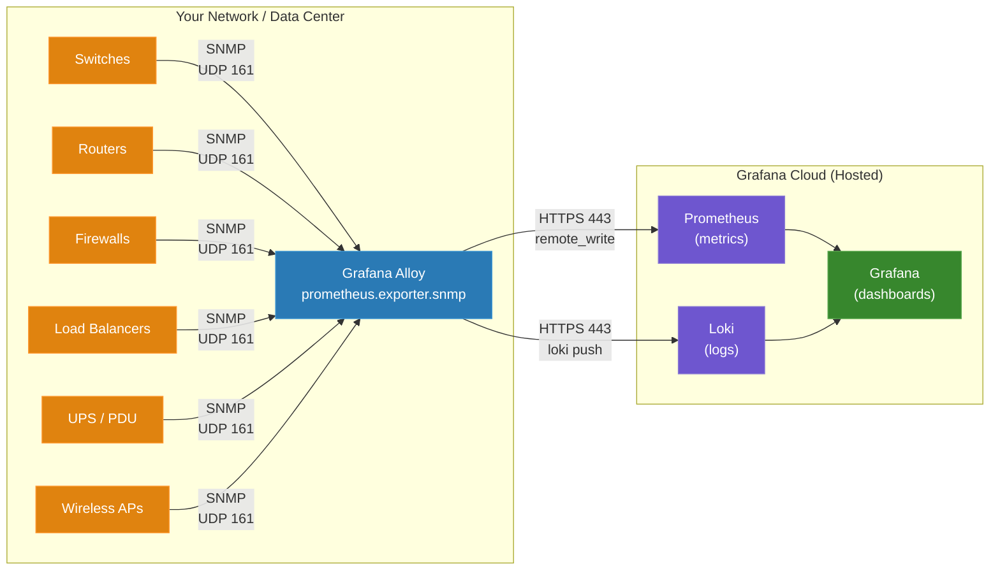

# Network Device Monitoring with Grafana Cloud


A reference guide for network engineers moving from SolarWinds, ThousandEyes, PRTG, or similar NMS platforms to Grafana Cloud with Prometheus.

## Contents

- [The Concept Map](#the-concept-map) — SolarWinds vocabulary translated to Grafana Cloud
- [Architecture](#architecture-what-replaces-your-nms-server) — what replaces your NMS server
- [Install Alloy](#step-1-install-alloy) — Windows-first setup
- [SNMP Module File](#step-2-get-the-snmp-module-file) — OID-to-metric mapping
- [Configure Alloy](#step-3-configure-alloy) — production config with multi-module examples
- [Verify](#step-4-verify-its-working) — confirm data is flowing
- [Dashboards](#step-5-dashboards) — pre-built and custom
- [Labels](#labels-the-equivalent-of-custom-properties) — how labeling replaces SolarWinds Custom Properties
- [Alerting](#alerting) — OOTB rules and the alert builder
- [ThousandEyes Replacement](#replacing-thousandeyes-functionality) — synthetic monitoring
- [Cost Model](#cost-model-per-node-vs-per-series) — per-node vs per-series comparison
- [Scaling](#scaling-multi-site-and-large-networks) — multi-site and large networks
- [SNMP Traps](#snmp-traps) — receiving traps alongside polling
- [Streaming Telemetry](#streaming-telemetry) — gNMI, NETCONF, and MDT
- [Migration Checklist](#migration-checklist) — plan of attack
- [SNMP v2c vs v3](#snmp-v2c-vs-v3-when-to-use-which) — when to use which
- [PromQL Quick Reference](#quick-reference-solarwinds-to-promql) — SolarWinds metric translation table

## The Concept Map

The single biggest hurdle is vocabulary. Here's the Rosetta Stone:

| SolarWinds / ThousandEyes | Grafana Cloud Equivalent | Notes |
|---|---|---|
| **Orion Server** | **Grafana Cloud stack** | Hosted SaaS — no server to maintain |
| **Orion Poller / Remote Poller** | **Grafana Alloy** | Lightweight collector deployed near your devices |
| **Node** | **Target** | A device Alloy polls via SNMP |
| **Interface** | **Labels on a metric** | Each port becomes a label combination, not a separate object |
| **Custom Properties** | **Labels** | Categorize devices by site, role, department, criticality — [details below](#labels-the-equivalent-of-custom-properties) |
| **UnDP (Universal Device Poller)** | **Custom MIB module in snmp.yml** | Define vendor-specific OIDs to poll |
| **MIB Studio / MIB Browser** | **snmpwalk + SNMP Exporter generator** | CLI tools that parse MIBs into Alloy-readable config |
| **Alert / Advanced Alert** | **Grafana Alerting** | GUI-based alert builder, or write PromQL directly (like SWQL in SolarWinds) |
| **NPM Dashboard / NOC View** | **Grafana dashboard** | Fully customizable; JSON-based, version-controllable |
| **SolarWinds AppStack / Dependencies** | **Grafana canvas panel + service maps** | Topology visualization |
| **ThousandEyes Agent** | **Grafana Synthetic Monitoring** | Probes from global PoPs; HTTP, DNS, ping, traceroute |
| **ThousandEyes Path Visualization** | **Synthetic Monitoring traceroute checks** | Hop-by-hop latency visualization |
| **PRTG Sensor** | **Prometheus metric** | Each thing you measure is a metric with labels |
| **PRTG Probe** | **Alloy instance** | Deployed in each site/segment |
| **Per-node licensing** | **Per-active-series pricing** | Pay for what you send, not how many devices you have |

## Architecture: What Replaces Your NMS Server



**Alloy** is the only component you deploy on-prem. It runs on a Windows or Linux machine near your network devices. It polls devices via SNMP, converts responses to Prometheus metrics, and ships them to Grafana Cloud over HTTPS (port 443 outbound only).

There is no database to manage, no web server to patch, no SQL backend to tune. If you've spent time maintaining Orion database health or sizing PRTG core servers, that operational burden goes away.

| Concern | SolarWinds Orion | Grafana Alloy |
|---|---|---|
| **Deployment** | Windows Server + SQL Server | Single binary, ~100 MB, Windows or Linux |
| **Infrastructure licensing** | Windows Server + SQL Server licenses required (can exceed the cost of the SW license) | None — just the Grafana Cloud subscription |
| **High availability** | Additional Orion HA server | Run two Alloy instances with the same config |
| **Updates** | Orion upgrade cycle (downtime) | Replace binary, restart service |
| **Config management** | GUI-driven, hard to version-control | Text files. Git-friendly |
| **Resource footprint** | 16+ GB RAM, dedicated SQL Server | ~256 MB RAM for typical SNMP workload |

## Step 1: Install Alloy

Alloy replaces the SolarWinds poller. You need a machine with network reachability to your SNMP devices on UDP port 161.

> **Tip for SolarWinds users:** You can install Alloy directly on your existing Orion server. It's already on your firewall allow lists and can reach your network devices, which is the fastest way to get started. When the migration is complete, just disable the SolarWinds services.

### Windows (Recommended for SolarWinds Users)

Download the latest Windows installer from the [Alloy releases page](https://github.com/grafana/alloy/releases) (the `.exe.zip` file). Run the installer — it registers Alloy as a Windows service.

The config file lives at `C:\Program Files\GrafanaLabs\Alloy\config.alloy`. The SNMP module file goes alongside it at `C:\Program Files\GrafanaLabs\Alloy\snmp.yml`.

Set environment variables for the Alloy service via System Properties > Environment Variables, or use the `setx` command:

```cmd
setx GRAFANA_METRICS_URL "https://prometheus-prod-XX-prod-us-east-0.grafana.net/api/prom/push"
setx GRAFANA_METRICS_USERNAME "YOUR_STACK_ID"
setx GCLOUD_RW_API_KEY "YOUR_API_KEY"
setx SNMP_COMMUNITY "your-community-string"
```

Restart the Alloy service after setting variables.

Find your Grafana Cloud credentials at: **grafana.com -> My Account -> your stack -> Prometheus details -> Remote Write Endpoint**.

### Linux

```bash
# Debian/Ubuntu
sudo apt-get install -y gpg
sudo mkdir -p /etc/apt/keyrings/
wget -q -O - https://apt.grafana.com/gpg.key | gpg --dearmor | sudo tee /etc/apt/keyrings/grafana.gpg > /dev/null
echo "deb [signed-by=/etc/apt/keyrings/grafana.gpg] https://apt.grafana.com stable main" | sudo tee /etc/apt/sources.list.d/grafana.list
sudo apt-get update
sudo apt-get install -y alloy
```

For systemd deployments, set environment variables in `/etc/alloy/env`. Config goes in `/etc/alloy/config.alloy`, SNMP module file in `/etc/alloy/snmp.yml`.

## Step 2: Get the SNMP Module File

In SolarWinds, MIB handling is automatic. In the Prometheus world, available OIDs are defined in a **module file** (`snmp.yml`) that maps SNMP OIDs to Prometheus metric names.

### Use the Default (Covers Most Devices)

Download the latest `snmp.yml` from the [snmp_exporter releases page](https://github.com/prometheus/snmp_exporter/releases) and place it alongside your Alloy config.

The default file includes modules for:

| Module | Covers |
|---|---|
| `if_mib` | Standard interface metrics (RFC 2863) — universal across network devices |
| `system` | sysUpTime, sysName, sysDescr, sysLocation |
| `hrDevice`, `hrStorage` | Host resources — CPU load, memory/storage utilization |
| `cisco_device` | Cisco-specific CPU, memory, environment sensors |
| `juniper` | Juniper device metrics |
| `mikrotik` | MikroTik RouterOS metrics |
| `apcups` | APC UPS systems |

For most network monitoring, combining `if_mib` with `system` and either `hrDevice`/`hrStorage` (generic) or a vendor-specific module (like `cisco_device`) gives you interface traffic, errors, status, CPU, memory, and hardware sensors — comparable to what SolarWinds monitors by default.

### Custom MIBs (When You Need Them)

If the default `snmp.yml` doesn't cover a device, you can generate a custom module from the vendor's MIB files using the [snmp_exporter generator](https://github.com/prometheus/snmp_exporter/tree/main/generator). This is the escape hatch, not the starting point — the default modules cover the most common devices.

**Important:** MIB files must match the firmware version on your devices. Mismatched MIBs cause walk timeouts and missing metrics.

## Step 3: Configure Alloy

This is the production-ready Alloy configuration. The SolarWinds equivalent of this file is: adding nodes in the Orion web console, assigning pollers, configuring credentials, and selecting what to monitor. Here, it's all in one text file.

**Windows:** `C:\Program Files\GrafanaLabs\Alloy\config.alloy`

**Linux:** `/etc/alloy/config.alloy`

```alloy
// ================================================================
// Network Device Monitoring via SNMP
// ================================================================

// --- Where to send metrics (your Grafana Cloud stack) ---
prometheus.remote_write "grafana_cloud" {
  endpoint {
    url = sys.env("GRAFANA_METRICS_URL")
    basic_auth {
      username = sys.env("GRAFANA_METRICS_USERNAME")
      password = sys.env("GCLOUD_RW_API_KEY")
    }
  }
}

// --- Load the SNMP module file ---
local.file "snmp_modules" {
  filename = "/etc/alloy/snmp.yml"  // Windows: "C:\\Program Files\\GrafanaLabs\\Alloy\\snmp.yml"
}

// --- Define your devices ---
prometheus.exporter.snmp "network_devices" {
  config = local.file.snmp_modules.content

  // Cisco switches — use if_mib + cisco_device for CPU, memory, sensors
  target "core-sw-01" {
    address     = "10.0.1.1"
    module      = "if_mib,cisco_device"
    auth        = "v2c_readonly"
    walk_params = "standard"
  }

  target "core-sw-02" {
    address     = "10.0.1.2"
    module      = "if_mib,cisco_device"
    auth        = "v2c_readonly"
    walk_params = "standard"
  }

  // Generic devices — use if_mib + system + host resources
  target "access-sw-01" {
    address     = "10.0.2.1"
    module      = "if_mib,system,hrDevice,hrStorage"
    auth        = "v2c_readonly"
    walk_params = "standard"
  }

  target "access-sw-02" {
    address     = "10.0.2.2"
    module      = "if_mib,system,hrDevice,hrStorage"
    auth        = "v2c_readonly"
    walk_params = "standard"
  }

  // Firewall with SNMPv3
  target "fw-01" {
    address     = "10.0.0.1"
    module      = "if_mib,system,hrDevice"
    auth        = "v3_secure"
    walk_params = "standard"
  }

  // --- SNMP transport settings ---
  walk_params "standard" {
    retries        = 2
    timeout        = "30s"
    max_repetitions = 25
  }

  // --- SNMP v2c auth ---
  auth "v2c_readonly" {
    community = sys.env("SNMP_COMMUNITY")
  }

  // --- SNMP v3 auth (for devices that require it) ---
  auth "v3_secure" {
    security_level = "authPriv"
    username       = sys.env("SNMP_V3_USERNAME")
    auth_protocol  = "SHA"
    auth_password  = sys.env("SNMP_V3_AUTH_PASSWORD")
    priv_protocol  = "AES"
    priv_password  = sys.env("SNMP_V3_PRIV_PASSWORD")
  }
}

// --- Add standard labels ---
discovery.relabel "network_devices" {
  targets = prometheus.exporter.snmp.network_devices.targets

  rule {
    target_label = "job"
    replacement  = "integrations/snmp"
  }

  rule {
    target_label = "instance"
    replacement  = constants.hostname
  }
}

// --- Poll devices ---
prometheus.scrape "network_devices" {
  targets         = discovery.relabel.network_devices.output
  forward_to      = [prometheus.relabel.network_devices.receiver]
  scrape_interval = "60s"
  scrape_timeout  = "55s"
}

// --- Control which metrics are sent (cost control) ---
prometheus.relabel "network_devices" {
  forward_to = [prometheus.remote_write.grafana_cloud.receiver]

  rule {
    source_labels = ["__name__"]
    regex = join([
      "up",
      "snmp_scrape_duration_seconds",
      "snmp_scrape_pdus_returned",
      "snmp_scrape_walk_duration_seconds",

      // Interface status
      "ifAdminStatus",
      "ifOperStatus",
      "ifHighSpeed",
      "ifName",
      "ifAlias",
      "ifDescr",

      // Interface traffic (64-bit counters)
      "ifHCInOctets",
      "ifHCOutOctets",
      "ifHCInUcastPkts",
      "ifHCOutUcastPkts",

      // Interface errors
      "ifInErrors",
      "ifOutErrors",
      "ifInDiscards",
      "ifOutDiscards",

      // System info
      "sysUpTime",
      "sysName",
      "sysDescr",
      "sysLocation",

      // CPU and memory (generic)
      "hrProcessorLoad",
      "hrStorageUsed",
      "hrStorageSize",
      "hrStorageDescr",

      // Cisco-specific CPU and memory
      "cpmCPUTotal1minRev",
      "cpmCPUTotal5minRev",
      "cpmCPUMemoryUsed",
      "cpmCPUMemoryFree",

      // Cisco environment sensors
      "ciscoEnvMonTemperatureStatusValue",
      "ciscoEnvMonFanState",
      "ciscoEnvMonSupplyState",
    ], "|")
    action = "keep"
  }

  // Drop admin-down interfaces (unused ports)
  rule {
    source_labels = ["ifAdminStatus"]
    regex         = "2"
    action        = "drop"
  }
}
```

### Config Walkthrough for SolarWinds Users

| Config Block | SolarWinds Equivalent | What It Does |
|---|---|---|
| `prometheus.remote_write` | Database connection | Where metrics are stored (Grafana Cloud) |
| `local.file "snmp_modules"` | MIB database | Loads the OID-to-metric mapping |
| `target "core-sw-01"` | Add Node wizard | Defines a device to monitor |
| `module = "if_mib,cisco_device"` | Selecting pollers/monitors on a node | Which metric groups to collect |
| `auth "v2c_readonly"` | SNMP credentials in Node properties | Community string or v3 credentials |
| `walk_params "standard"` | Polling engine settings | Timeout, retries, bulk size |
| `prometheus.scrape` | Polling interval setting | How often to poll (60s here) |
| `prometheus.relabel` | No direct equivalent (SolarWinds collects everything) | Filters which metrics to keep — this is how you control cost |

### A Note on Timeout and Retries

The config above uses a 30-second timeout with 2 retries. Most SNMP collection issues are slow device responses, not dropped packets on the local network. A longer timeout with fewer retries is usually more effective than a short timeout with many retries.

If you're polling devices across a WAN link, increase the timeout further (45-60s) and consider keeping retries at 1.

## Step 4: Verify It's Working

### Test SNMP Connectivity

This is the equivalent of the SolarWinds "Test" button on the Node properties page:

```bash
# SNMP v2c — does the device respond?
snmpwalk -v2c -c $SNMP_COMMUNITY 10.0.1.1 sysDescr

# Expected output:
# SNMPv2-MIB::sysDescr.0 = STRING: Cisco IOS Software, C9300 Software...

# SNMP v3
snmpwalk -v3 -l authPriv -u monitoring -a SHA -A "$AUTH_PASS" \
  -x AES -X "$PRIV_PASS" 10.0.1.1 sysDescr
```

**If this times out**, fix it before touching Alloy config:
- Firewall: UDP 161 from the Alloy host to the device
- SNMP enabled on the device (`show snmp` on Cisco)
- Correct community string / v3 credentials
- SNMP access list on the device permits the Alloy host's IP

### Query in Grafana Cloud

Once Alloy is running, go to your Grafana Cloud instance -> Explore -> select your Prometheus data source, and run:

```promql
up{job="integrations/snmp"}
```

Each target with a value of `1` is being polled successfully. `0` means the SNMP walk is failing.

## Step 5: Dashboards

### Pre-Built Dashboards (Fastest Path)

Grafana Cloud includes a built-in SNMP integration that gives you:
- **3 pre-built dashboards** (fleet overview, device detail, logs)
- **14 alert rules** (interface down, high CPU, memory, reboot detection, exporter health)
- **61 pre-mapped metrics** across vendor-neutral and vendor-specific modules

Install it from: **Grafana Cloud -> Connections -> Add new connection -> SNMP**.

This is the closest thing to SolarWinds' out-of-the-box experience. Start here, then customize.

### Custom Dashboards with Grafana Assistant

For custom dashboards beyond what the integration provides, use **Grafana Assistant** (the AI assistant built into Grafana Cloud). You can describe what you want in natural language — "show me a table of my top 10 busiest interfaces sorted by utilization" — and it builds the panel for you, including the underlying query.

This is the recommended path for users who are new to PromQL. You don't need to learn query syntax to build effective dashboards.

### Dashboard Layout Recommendations

Build your dashboards to answer the same questions your NOC asks today:

| NOC Question | SolarWinds View | Grafana Panel Type |
|---|---|---|
| "What's down right now?" | Active Alerts / All Nodes view | Stat panel showing down count |
| "What's close to capacity?" | Top 10 Interfaces resource | Table panel with utilization % |
| "Is this interface erroring?" | Interface details / Errors tab | Time series panel |
| "When did it go down?" | Events / Syslog | Time series with Loki log annotations |
| "What's the traffic trend?" | Interface traffic graph | Time series panel |
| "Network topology" | Network Atlas / Orion Maps | Canvas panel with device layout |

## Labels: The Equivalent of Custom Properties

If you've used SolarWinds, you know Custom Properties — fields you add to nodes to categorize them by site, department, criticality, device role, maintenance window, and so on. Custom Properties drive everything in SolarWinds: views, grouping, alert routing, and reporting.

**Prometheus labels serve the same purpose.** Every metric can carry labels that describe the device, and you use those labels to filter dashboards, route alerts, and organize your fleet.

### Adding Labels in Target Config

Labels are added in the target definition or via discovery:

```alloy
target "core-sw-01" {
  address     = "10.0.1.1"
  module      = "if_mib,cisco_device"
  auth        = "v2c_readonly"
  walk_params = "standard"
}
```

To add custom labels to targets, use `discovery.relabel` rules:

```alloy
discovery.relabel "network_devices" {
  targets = prometheus.exporter.snmp.network_devices.targets

  rule {
    target_label = "job"
    replacement  = "integrations/snmp"
  }

  // Custom labels — equivalent of SolarWinds Custom Properties
  rule {
    source_labels = ["snmp_target"]
    regex         = "core-.*"
    target_label  = "device_role"
    replacement   = "core"
  }

  rule {
    source_labels = ["snmp_target"]
    regex         = "access-.*"
    target_label  = "device_role"
    replacement   = "access"
  }
}
```

For file-based service discovery (recommended for larger environments), labels are defined directly in the YAML targets file:

```yaml
# /etc/alloy/snmp-targets.yml
- labels:
    name: core-sw-01
    module: if_mib,cisco_device
    auth: v2c_readonly
    site: dc-east
    device_role: core
    department: infrastructure
    criticality: high
  targets:
    - 10.0.1.1
```

### Using Labels

Once labels are on your metrics, they work everywhere:

| SolarWinds Custom Property Use | Grafana Label Equivalent |
|---|---|
| Group nodes by site in views | Dashboard variable filtering by `site` label |
| Route alerts by department | Notification policy matching on `department` label |
| Report by criticality | PromQL filter: `{criticality="high"}` |
| Maintenance window by group | Alert mute timing scoped to label values |
| Custom NOC views per team | Dashboard with variable dropdowns for each label |

## Alerting

### Start with the Built-In Rules

The Grafana Cloud SNMP integration includes **14 pre-built alert rules** across three groups:

| Group | Rules | Coverage |
|---|---|---|
| `integration-snmp-alerts` | 8 rules | Interface down, high CPU, memory utilization, device rebooted, and more |
| `integration-snmp-fc-alerts` | 3 rules | Flow collector alerts |
| `integration-snmp-exporter-alerts` | 3 rules | Exporter health: empty response, slow scrape, no response |

The exporter health alerts are worth highlighting — they tell you when your *monitoring itself* is broken, not just the network. SolarWinds doesn't have a built-in equivalent of this.

SolarWinds NPM ships ~50 default network alert definitions (and ~200 across all modules). The Grafana integration starts with a curated set of 14 covering the most critical scenarios. If you've dealt with SolarWinds alert noise, you may appreciate the leaner starting point — you can always add more.

### Building Custom Alerts

Grafana's alert builder provides a **visual query builder** that works similarly to the SolarWinds alert condition wizard — you select a metric, choose a threshold, and set evaluation intervals. No query language required for basic alerts.

For advanced alert conditions, you can write PromQL directly in the alert definition — similar to how SolarWinds allows SWQL or SQL in advanced alerts. PromQL is the underlying query language for Prometheus metrics.

### Alert Routing

Grafana Cloud alerting supports email, Slack, Microsoft Teams, PagerDuty, OpsGenie, and webhooks via **contact points**. You route alerts using **notification policies** that match on labels (device role, site, severity) — similar to how SolarWinds uses Custom Properties to route alerts to different teams.

The workflow for configuring alert routing is different from SolarWinds — it uses a policy tree rather than per-alert configuration — and takes some getting used to. The capabilities are equivalent: routing by any label, silences for maintenance windows, and escalation chains.

## Replacing ThousandEyes Functionality

ThousandEyes provides **synthetic testing** (is this URL/service reachable and fast?) and **path analysis** (what's the network path and where is the latency?).

### Synthetic Monitoring

Grafana Cloud Synthetic Monitoring runs checks from globally distributed probes — similar to ThousandEyes Cloud Agents.

| ThousandEyes Test Type | Grafana Synthetic Monitoring Equivalent |
|---|---|
| HTTP Server test | HTTP check (URL, status code, response time, SSL expiry) |
| DNS Server test | DNS check (resolution time, correct records) |
| Network - Agent to Server | Ping/ICMP check (latency, packet loss) |
| Network - Path Visualization | Traceroute check with hop-by-hop latency visualization |
| BGP Route test | No direct equivalent — use SNMP BGP metrics from your routers |
| Web Transaction (Selenium) | Scripted browser check (k6-based) |

Configure checks at: **Grafana Cloud -> Synthetic Monitoring -> Add Check**.

### Gaps vs. ThousandEyes

| ThousandEyes Feature | Status in Grafana Cloud |
|---|---|
| BGP Route Visualization (AS path view) | Not available as SaaS — collect BGP state via SNMP from your routers |
| Internet Outage Detection | Not available — synthetic monitoring from multiple probes provides partial coverage |
| WAN Insights | Not available — combine SNMP interface metrics with synthetic check latency |

ThousandEyes' ability to visualize BGP routes across the public internet from third-party vantage points has no direct equivalent. For monitoring your own infrastructure and services, synthetic monitoring plus SNMP covers the vast majority of use cases.

## Cost Model: Per-Node vs. Per-Series

**SolarWinds** charges per managed node (SL100 = 100 nodes, SL2000 = 2000 nodes) plus Windows Server and SQL Server license costs. A 48-port switch and a 4-port router cost the same — one node each.

**Grafana Cloud** charges per active series. A series is a unique combination of metric name + labels. There are no infrastructure licensing costs — no Windows Server, no SQL Server.

### Cost Comparison

| Scenario | SolarWinds NPM (per year) | Grafana Cloud (per year) |
|---|---|---|
| 10 switches (48-port) | SL100 license ~$2,995 + maintenance + Windows/SQL licensing | ~7,200 series (all ports) = ~$696. With port filtering: ~3,000 series = ~$288 |
| 100 switches (campus) | SL100+ license, ~$5,000+ + maintenance + Windows/SQL licensing | ~72,000 series = ~$6,912. With filtering: ~16,000 series = ~$1,536 |
| 500 mixed devices | SL500 license ~$12,475 + maintenance + Windows/SQL licensing | Varies by metric count. Budget $6,000-$24,000 depending on filtering |

*Grafana Cloud pricing based on $8 per 1,000 active series per month. SolarWinds pricing excludes Windows Server Standard (~$1,000/yr) and SQL Server Standard (~$3,800/yr) licenses, which are required but often overlooked in comparisons.*

### The Cardinality Formula

```
active_series = devices x active_ports_per_device x metrics_per_port
```

**Three levers to control cost:**

1. **Filter unused ports** — Drop interfaces where `ifAdminStatus = 2` (the relabel rule in the config above does this). On a typical 48-port access switch, 20-30 ports are usually unused.

2. **Limit metrics per port** — The allow-list in `prometheus.relabel` controls which OIDs are kept. Start with traffic + errors + status + system metrics. Add more only when dashboards need them.

3. **Scrape interval** — 60s is standard. Longer intervals don't reduce series count but reduce data ingestion volume.

### Grafana Cloud Free Tier

Grafana Cloud includes a free tier with 10,000 active series — enough for ~25 switches with active-port filtering, or ~130 devices with 10 active interfaces. This lets you evaluate the platform with real production data before committing.

## Scaling: Multi-Site and Large Networks

### SolarWinds Scaling Model

SolarWinds scales by adding Additional Polling Engines (APEs) in remote sites. A single poller typically handles 1,000-5,000 nodes (with 16+ CPU cores and 32+ GB RAM). The Orion database is the bottleneck.

### Grafana Cloud Scaling Model

Grafana Cloud is SaaS — the backend scales automatically. You only scale the collectors:

| Scale | Deployment |
|---|---|
| **Small site (under 500 devices)** | One Alloy instance with file-based service discovery |
| **Multiple sites** | One Alloy instance per site, all shipping to the same Grafana Cloud stack |
| **Large site (500+ devices)** | Multiple Alloy instances with targets distributed across them |

Each Alloy instance can handle hundreds of devices, depending on device response time and how many OIDs you're collecting per device. The practical limit is determined by whether all walks can complete within your scrape interval — a device with 1,000 ports takes longer to walk than 50 devices with 24 ports each.

For large environments, use **file-based service discovery** to manage targets. Generate a YAML targets file from your CMDB, IPAM, or NetBox — Alloy watches the file and picks up changes automatically, no restart needed:

```yaml
# snmp-targets.yml — generated from your CMDB
- labels:
    name: core-sw-01
    module: if_mib,cisco_device
    auth: v2c_readonly
    site: dc-east
    device_role: core
  targets:
    - 10.0.1.1
- labels:
    name: core-sw-02
    module: if_mib,cisco_device
    auth: v2c_readonly
    site: dc-west
    device_role: core
  targets:
    - 10.0.1.2
```

This eliminates the need to manually maintain target blocks in the config file and keeps your device inventory in sync with your source of truth.

## SNMP Traps

SolarWinds and PRTG receive SNMP traps natively. The Prometheus SNMP Exporter is poll-only — it does not receive traps.

If your environment relies on traps, you have options:

### snmptrapd + Alloy Log Collection

Run `snmptrapd` to receive traps and write them to a log file. Alloy collects the log file and ships it to Grafana Cloud Loki, where you can search and alert on trap events. See the [snmptrapd configuration guide](http://www.net-snmp.org/wiki/index.php/TUT:Configuring_snmptrapd) for setup instructions.

### ktranslate

[Kentik's ktranslate](https://github.com/kentik/ktranslate) is an open-source collector that handles SNMP polling, SNMP trap reception, syslog, and NetFlow in a single tool. It can export to Prometheus format and integrates with Grafana Cloud. This is worth evaluating if you need traps alongside polling without assembling separate tools.

### Syslog as a Complement

Most events that generate SNMP traps also generate syslog messages. Forward device syslogs to Alloy (which ships them to Loki) for searchable, alertable log data alongside your metrics. This doesn't replace traps — it complements them.

## Streaming Telemetry

Modern network devices (Cisco IOS-XE/XR, Juniper Junos, Arista EOS) support **model-driven telemetry** using protocols like gNMI, NETCONF/YANG, and Cisco MDT. These push metrics from the device to a collector instead of waiting to be polled.

The main advantage over SNMP is reducing the overhead of poll-based collection at scale — eliminating the walk-based discovery cycle and the back-and-forth of SNMP requests.

Streaming telemetry is not required to get started. When you're ready to evaluate it:

| Protocol | Alloy Integration | Notes |
|---|---|---|
| gNMI | Requires middleware (e.g., gnmic) to translate to Prometheus format | Not natively supported in Alloy |
| NETCONF/YANG | Requires middleware | Not natively supported |
| Cisco MDT | Requires middleware (e.g., Telegraf, pipeline) | Not natively supported |

All three protocols require a translation layer between the device and Alloy/Prometheus. This is an area of active development but is not turnkey today. Start with SNMP; add streaming telemetry when you have a specific operational reason to move beyond polling.

## Migration Checklist

A focused migration takes approximately **40-80 hours of effort** — achievable in 1-2 weeks of dedicated work.

### Phase 1: Install and Validate (~8 hours)
- [ ] Install Alloy on your existing Orion server or a nearby VM
- [ ] Download the default `snmp.yml` module file
- [ ] Configure 5-10 representative devices (mix of vendors and roles)
- [ ] Verify metrics in Grafana Cloud Explore
- [ ] Install the SNMP integration (dashboards + alerts)
- [ ] Keep existing NMS running — compare data side by side

### Phase 2: Labels, Dashboards, and Alerts (~16 hours)
- [ ] Define your labeling strategy (map your Custom Properties to labels)
- [ ] Customize or build dashboards matching your current NOC views
- [ ] Review and tune the built-in alert rules
- [ ] Add custom alert rules for your environment
- [ ] Set up notification routing (Slack, PagerDuty, email)
- [ ] Add synthetic monitoring checks for critical services

### Phase 3: Full Fleet and Training (~16-40 hours)
- [ ] Add remaining devices (use file-based service discovery for 50+ devices)
- [ ] Configure syslog forwarding to Loki
- [ ] Set up trap collection if needed (snmptrapd or ktranslate)
- [ ] Deploy Alloy instances in remote sites
- [ ] Review cardinality and optimize cost
- [ ] Train NOC team on Grafana UI

### Phase 4: Cutover
- [ ] Confirm all critical alerts have Grafana equivalents
- [ ] Verify historical data needs are met (Grafana Cloud retains 13 months by default)
- [ ] Disable SolarWinds services (or decommission the server)

## SNMP v2c vs v3: When to Use Which

| Situation | Use |
|---|---|
| Lab / isolated management VLAN | v2c is fine |
| Production with compliance requirements (PCI, HIPAA, SOC2) | v3 with authPriv |
| Devices that only support v2c | v2c with restricted ACLs on the device |
| Mixed environment | Both — define separate auth blocks in Alloy |

v3 auth configuration in the Alloy config:

```alloy
auth "v3_secure" {
  security_level = "authPriv"      // noAuthNoPriv | authNoPriv | authPriv
  username       = sys.env("SNMP_V3_USERNAME")
  auth_protocol  = "SHA"           // MD5 or SHA
  auth_password  = sys.env("SNMP_V3_AUTH_PASSWORD")
  priv_protocol  = "AES"           // DES or AES
  priv_password  = sys.env("SNMP_V3_PRIV_PASSWORD")
}
```

## Quick Reference: SolarWinds to PromQL

For users who want to learn PromQL, here's a translation table. For most dashboard and alert work, the **Grafana Assistant** and **visual query builder** can generate these queries for you.

| SolarWinds Metric / View | PromQL Equivalent |
|---|---|
| Interface Receive bps | `rate(ifHCInOctets{ifName="GigabitEthernet0/1"}[5m]) * 8` |
| Interface Transmit bps | `rate(ifHCOutOctets{ifName="GigabitEthernet0/1"}[5m]) * 8` |
| Interface % Utilization | `rate(ifHCInOctets[5m]) * 8 / (ifHighSpeed * 1e6) * 100` |
| Interface Errors/sec | `rate(ifInErrors[5m])` |
| Interface Discards/sec | `rate(ifInDiscards[5m])` |
| Node Uptime (days) | `sysUpTime / 100 / 86400` |
| Top N Interfaces by Traffic | `topk(10, rate(ifHCInOctets[5m]) * 8)` |
| Interface Status (up/down) | `ifOperStatus` (1=up, 2=down) |
| CPU Utilization (Cisco) | `cpmCPUTotal5minRev` |
| Memory Used (Cisco) | `cpmCPUMemoryUsed` |
| Active Alerts Count | `count(ALERTS{alertstate="firing", job="integrations/snmp"})` |

## Further Reading

- [Grafana Alloy documentation](https://grafana.com/docs/alloy/latest/)
- [Grafana Cloud SNMP integration](https://grafana.com/docs/grafana-cloud/monitor-infrastructure/integrations/integration-reference/integration-snmp/)
- [Prometheus SNMP Exporter (GitHub)](https://github.com/prometheus/snmp_exporter)
- [SNMP Exporter generator documentation](https://github.com/prometheus/snmp_exporter/tree/main/generator)
- [Grafana Cloud Synthetic Monitoring](https://grafana.com/docs/grafana-cloud/testing/synthetic-monitoring/)
- [Grafana Alerting documentation](https://grafana.com/docs/grafana/latest/alerting/)
